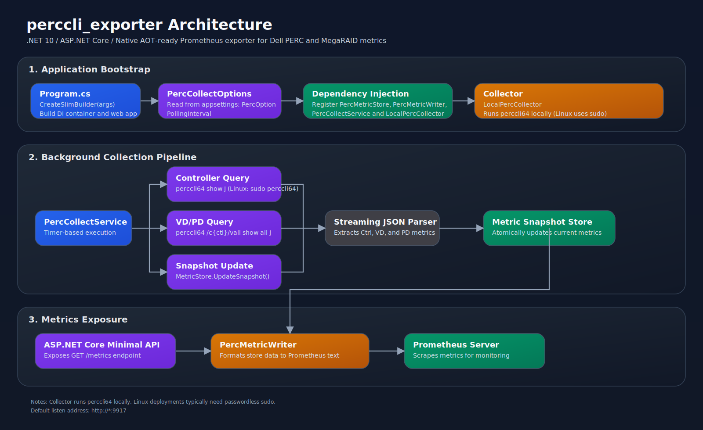

# 🧰 perccli_exporter

[简体中文](README.zh-CN.md) | [English](README.md)

一个用于 Dell PERC / MegaRAID 的 Prometheus Exporter，基于 .NET 10，通过解析 `perccli64` 的 JSON 输出暴露 RAID 健康指标。

## ✨ 功能特性
- 提供 `GET /metrics`（Prometheus 文本格式 `version=0.0.4`）。
- 后台定时轮询采集：控制器 / 虚拟盘（VD）/ 物理盘（PD）。
- 支持 Windows 与 Linux。
- 项目已开启 Native AOT（自包含发布）。

## 🏗️ 架构图


## ✅ 运行前置
- 需要安装 `perccli64`，并确保在 `PATH` 中可直接执行。
- Linux 下通常需要 `sudo` 执行 `perccli64`（或以 root 运行 exporter）。

## 🚀 运行
- 默认地址：`http://localhost:9917/metrics`
- 支持通过命令行参数或环境变量覆盖端口。

### 命令行参数
Linux：

```bash
./perccli_exporter --port 9917
```

或使用 `-p`：

```bash
./perccli_exporter -p 9917
```

Windows：

```powershell
.\perccli_exporter.exe --port 9917
```

或使用 `-p`：

```powershell
.\perccli_exporter.exe -p 9917
```

### 环境变量
支持的环境变量：
- `PERC_EXPORTER_PORT`
- `PORT`

PowerShell 示例：

```powershell
$env:PERC_EXPORTER_PORT="9917"
.\perccli_exporter.exe
```

### 完整 URL 覆盖（ASP.NET Core 标准方式）
如需绑定特定地址（或多个 URL），可使用 `ASPNETCORE_URLS` 或 `--urls`。
当设置了 `ASPNETCORE_URLS`/`--urls` 时，`--port` 会被忽略。

Linux：

```bash
export ASPNETCORE_URLS="http://*:9917"
./perccli_exporter
```

```powershell
$env:ASPNETCORE_URLS="http://*:9917"
.\perccli_exporter.exe
```

## ⚙️ 配置说明
配置节点：`PercOption`

```json
{
  "Urls": "http://*:9917",
  "PercOption": {
    "PollingInterval": 3
  }
}
```

- `Urls`：Kestrel 监听地址。
- `PercOption:PollingInterval`：采集间隔（秒）。

## 📈 指标列表
### 🎛️ 控制器指标
| 指标名称 | 标签 | 说明 |
| --- | --- | --- |
| `perc_controller_count` | - | RAID 控制器数量 |
| `perc_controller_info` | `ctl`, `model` | 控制器元信息（值恒为 1） |
| `perccli_controller_health_status` | `ctl` | 控制器整体健康状态（1=Optimal，0=其他） |
| `perccli_bbu_status` | `ctl` | BBU 状态（实现内做了枚举映射） |
| `perccli_patrol_read_status` | `ctl` | 计划巡检状态（实现内做了枚举映射） |
| `perccli_emergency_hot_spare_status` | `ctl` | 应急热备（EHS）策略状态（1=启用，0=禁用） |
| `perccli_ports_total` | `ctl` | 控制器物理端口总数 |
| `perccli_physical_drives_total` | `ctl` | 物理盘（PD）总数 |
| `perccli_physical_drives_degraded_count` | `ctl` | 非最佳状态的物理盘数量 |
| `perccli_drive_groups_total` | `ctl` | 盘组（DG）总数 |
| `perccli_virtual_drives_total` | `ctl` | 虚拟盘（VD）总数 |
| `perccli_virtual_drives_degraded_count` | `ctl` | 非最佳状态的虚拟盘数量 |
| `perccli_dimmer_switch_status` | `ctl` | 省电 Dimmer Switch 状态（实现内做了映射） |
| `perccli_advanced_software_options_count` | `ctl` | 高级软件选项（ASO）启用数量 |

### 💽 虚拟盘指标（VD）
| 指标名称 | 标签 | 说明 |
| --- | --- | --- |
| `perccli_virtual_drive_info` | `ctl`, `dg`, `vd`, `type`, `access`, `cache`, `cac`, `name`, `os_device`, `naa_id` | 虚拟盘元信息（值恒为 1） |
| `perccli_virtual_drive_state` | `ctl`, `dg`, `vd` | 虚拟盘状态（1=Optl，2=Degraded，3=Offline，0=其他） |
| `perccli_virtual_drive_consistent_status` | `ctl`, `dg`, `vd` | 一致性状态（1=Yes/Consistent，0=No/其他） |
| `perccli_virtual_drive_scc_status` | `ctl`, `dg`, `vd` | 计划一致性检查（sCC）状态（1=ON，0=OFF） |
| `perccli_virtual_drive_size_bytes` | `ctl`, `dg`, `vd` | 虚拟盘容量（字节） |
| `perccli_virtual_drive_active_operation` | `ctl`, `dg`, `vd` | 活动操作状态（0=无，1=后台操作进行中，2=未知） |

### 🧱 物理盘指标（PD）
| 指标名称 | 标签 | 说明 |
| --- | --- | --- |
| `perccli_physical_drive_info` | `ctl`, `vd`, `eid`, `slt`, `did`, `dg`, `intf`, `med`, `model`, `type`, `sed`, `pi` | 物理盘元信息（值恒为 1） |
| `perccli_physical_drive_state` | `ctl`, `vd`, `eid`, `slt` | 物理盘状态（1=Onln，2=Offln，3=Rbld，4=GHS，5=UGood，0=其他） |
| `perccli_physical_drive_size_bytes` | `ctl`, `vd`, `eid`, `slt` | 物理盘容量（字节） |
| `perccli_physical_drive_sector_size_bytes` | `ctl`, `vd`, `eid`, `slt` | 物理盘扇区大小（字节） |
| `perccli_physical_drive_sp_status` | `ctl`, `vd`, `eid`, `slt` | 热备状态（0=非热备，1=专用热备 HS，2=全局热备 PS） |

## 🔐 Linux sudoers 示例
如果希望 exporter 以非 root 用户运行，可以仅为 `perccli64` 开放免密码 sudo：

```bash
sudo tee /etc/sudoers.d/perccli64 >/dev/null <<'EOF'
your_user ALL=(root) NOPASSWD: /usr/sbin/perccli64
EOF
sudo chmod 0440 /etc/sudoers.d/perccli64
```

## 📄 许可证
MIT License，见 [LICENSE](LICENSE)。
